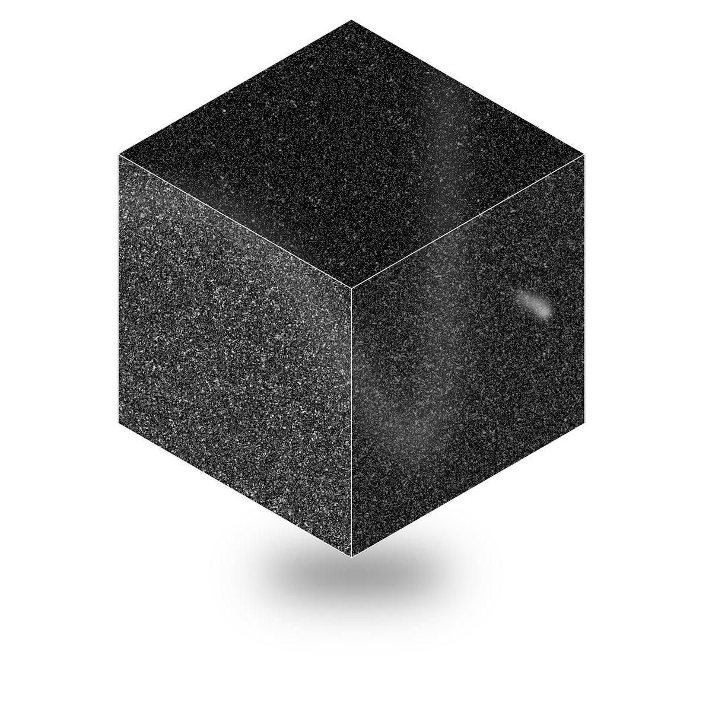

# Welcome to Code Mavi.

	

Code Mavi is an open-source AI IDE focused on advanced agentic workflows.

It is a fork of Void, with the goal of implementing a robust, transparent, and customizable agent architecture.

- 🧭 [Website](https://github.com/code-mavi/codemavi)
- 👋 [Discord](https://discord.gg/RSNjgaugJs)
- 🚙 [Project Plan](https://github.com/code-mavi/codemavi/blob/main/plan.md)

## Reference

Code Mavi is built on top of the [Void](https://github.com/voideditor/void) and [vscode](https://github.com/microsoft/vscode) repositories. For a guide to the codebase, see [CODEMAVI_CODEBASE_GUIDE](https://github.com/code-mavi/codemavi/blob/main/CODEMAVI_CODEBASE_GUIDE.md).

For development instructions, see [HOW_TO_CONTRIBUTE](https://github.com/code-mavi/codemavi/blob/main/HOW_TO_CONTRIBUTE.md).

## Support
You can reach us via GitHub Issues.
